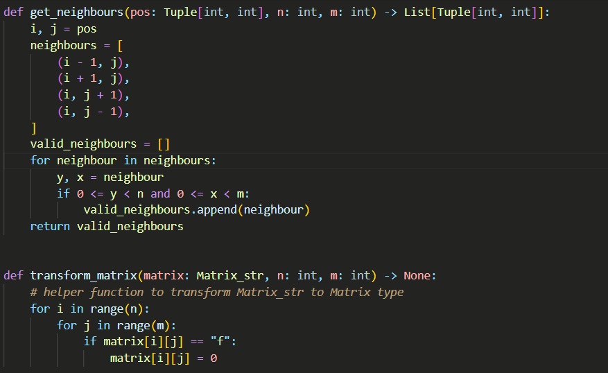

# KRIXT THEME

## CODE SAMPLES

 This theme was made for casual coders like me!
it came with a very good looking *pastel* color so it can also protect your eyes!

## Changed Logs

### update 0.0.1

first krixt theme release

### update 0.0.2

description changed

## Getting Started

 to install its very simple
1. search the word "krxit-theme" in the extension search 

2. click the install button

3. after you done installing press the theme to use it.

its that simple!

## Credit

me. (kimza)

check my github for more intersing projects!

[https://github.com/kimzaaa](https://github.com/kimzaaa)

